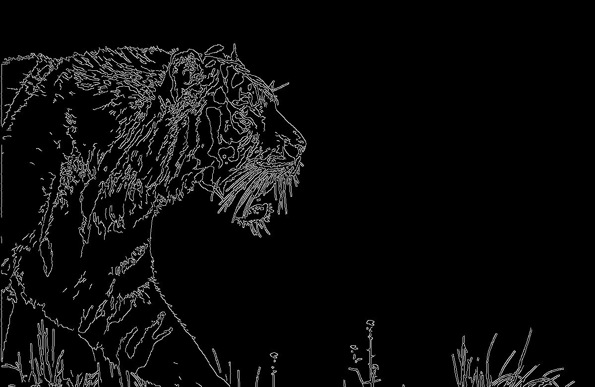

# EdgeDetection

A project that includes various ways to detect borders in an image. 
Will be complemented by various and modern methods. 
From simple to complex, including neural networks.

https://paperswithcode.com/task/edge-detection

1. Sobel Edge Detection

By X

By Y

By XY

2. Canny Edge Detection

3. Laplacian Operator

4. LoG and DoG Edge Detection

